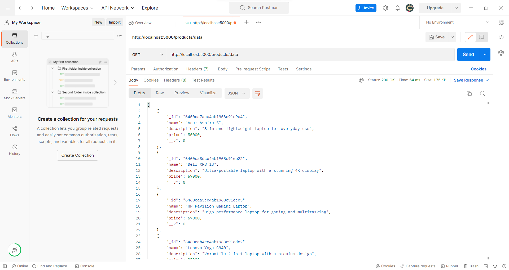
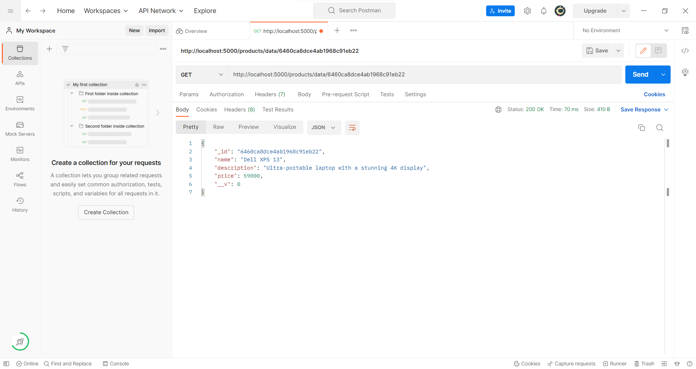
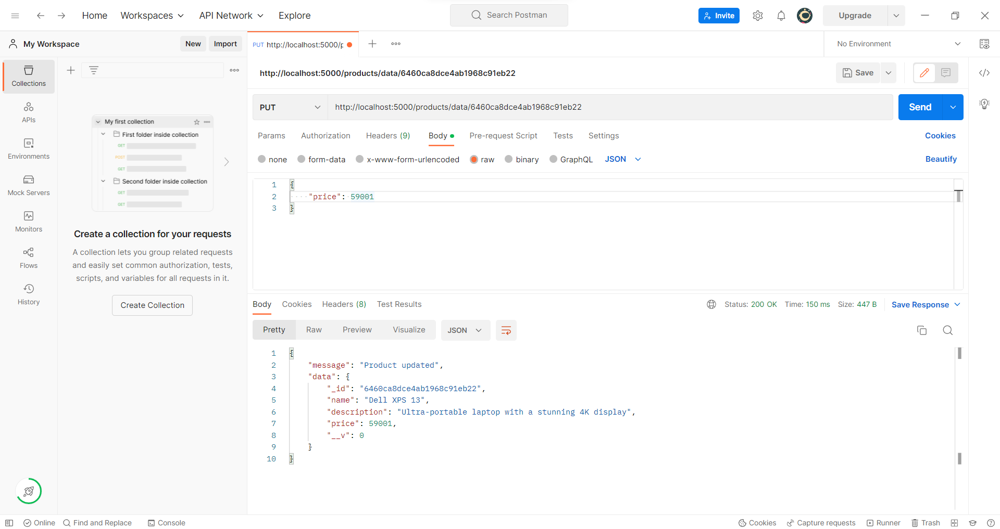
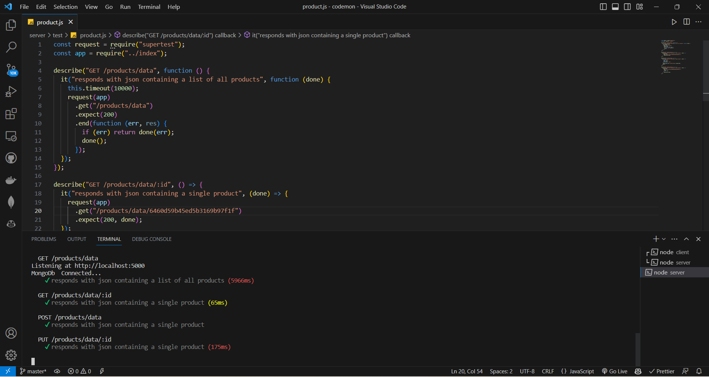
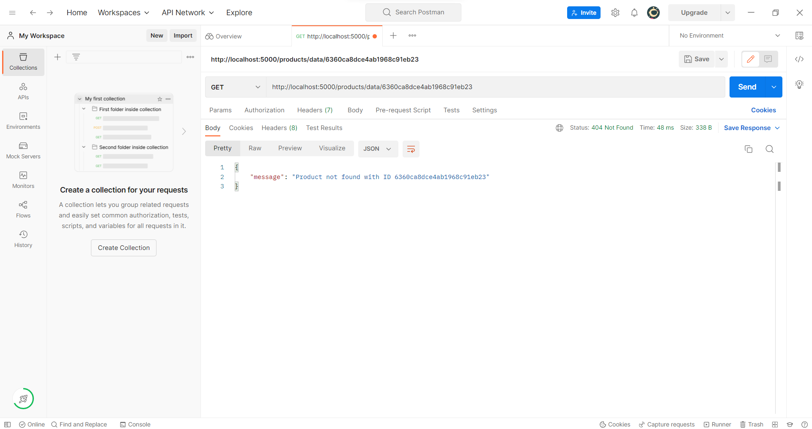
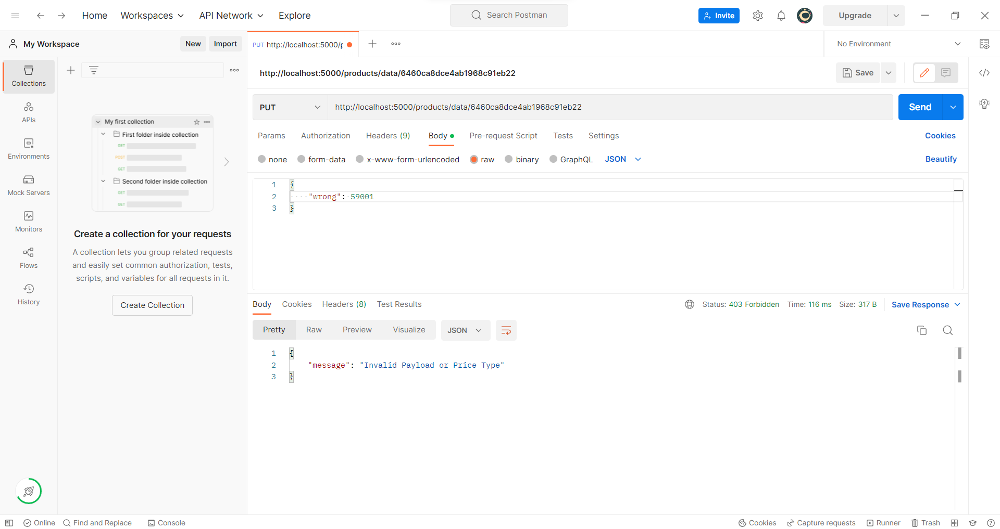

# Codemon 
##### - APIS USED ARE AS FOLLOWED:

### 1. GET /products/data
##### - It displays all the products stored in the database (format {_id, name; description, price, __v})

### 2. GET /products/data/:id
##### - It displays the details of the product with the id passed as parameter (_id which is auto generated by MongoDB)

### 3. PUT /products/data/:id
##### - It updates the value of price of the product with id passed as parameter

### 4. Unit Testing Using Mocha
##### Performed Unit tests (ie... GET, PUT, POST) using Mocha for the applicable API endpoints.

##### - Error Handling when Wrong Product Id is passed

##### - Error Handling when Wrong Payload is passed

#### To run Testing got to the server directory and run the following command in the terminal
### npx mocha
